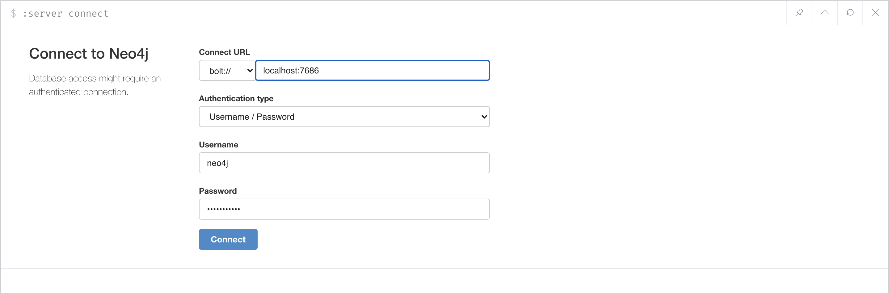
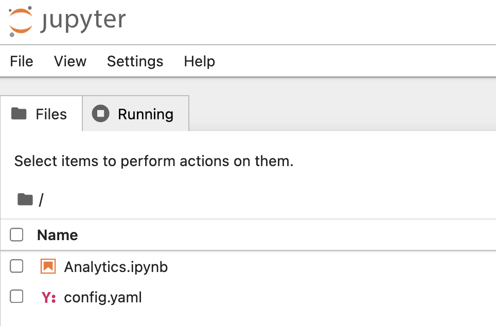
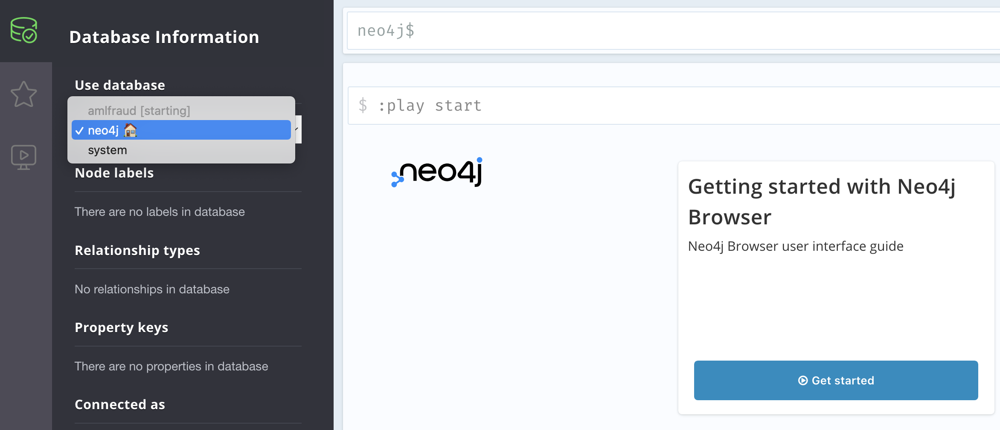

# Graph Data Science for Entity Resolution and Fraud Detection

This repository contains all the required scripts for hands-on exercises covering the following topics:
* Entity Resolution
* First Party Fraud Detection
* Second Party Fraud Detection

The purpose of this exercises is to enhance your knowledge of Graph Analytics, using the Neo4j Platform, and to guide you in the process of including this tool as part of your current Data Science pipeline.

In order to accomplish our goal, we are going to be setting up a development environment using Docker Containers. This environment consists of the following containers:
* __Jupyter__: Jupyter Python Notebooks.
* __Neo4j__: Neo4j Graph Database with the APOC and GDS libraries installed.

Bash and Power Shell scripts are provided to start, stop, list and remove all environment containers under the shell_scripts and powershell_scripts directories respectively. To get the environment up and running on your machine execute the start_environment file in the appropriate directory based on your operating system. If you encounter ports conflicts, please modify the port section under the services list in the Docker/docker-compose.yml file with ports not currently in used in your machine.

At this point you should be able to access Jupyter Notebook by accessing on your browser the following URL [http://localhost:8887](http://localhost:8887) (remember to change the port if modified) and by providing the __password JupyterL3tM31n!__. You should also be able to access the Neo4j Browser using the URL [http://localhost:7473](http://localhost:7473) and __password Neo4jL3tM31n!__.

Your Connect to Neo4j frame should look like this: 

Each container in the environment can also be access via terminal by executing the `docker exec` command. For instance, the Data Science Toolbox container can be access by running the following command: `docker exec -it docker_dstoolbox_1 /bin/bash`. 

Once you accessed Jupyter via browser and authenticated, you should be able to see the following files: 

The graph that we are using for this training is named amlfraud. Once you login into the Neo4j Browser you should be able to see this database in starting mode as illustrated below: 

This is because the database is seeding for a backup located in a S3 bucket. This process should take about 15 to 20 minutes depending on your internet speed. If for any reason the database fails to start please execute the following scripts in the Neo4j Browser:
> DROP DATABASE amlfraud;
>
> CREATE DATABASE amlfraud
>   OPTIONS {
>       existingData:‘use’,
>       seedURI:‘s3://neo4j-jefftallman/neo4j5-demo-dbs/amlfraud-2024-09-23T20-09-34.backup’,
>       seedConfig: ‘region=us-east-1’
>   }

To stop, remove, verify the status and view the logs of the environment execute the stop_environment, remove_environment, list_environment and view_environment_logs files respectively.